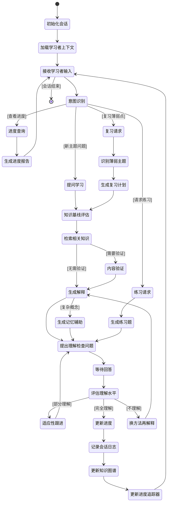

# 智能学习助手Agent (Smart Learner Agent)

基于LangGraph的通用智能学习辅导系统，采用ReAct模式编排多Agent协同，提供个性化学习体验。

[](https://python.org)
[](https://github.com/langchain-ai/langgraph)
[](LICENSE)

## 📋 项目概述

本项目是一个AI驱动的学习助手系统，通过LangGraph编排多个ReAct Agent协同工作，实现：
- ✅ 苏格拉底式教学对话（ReAct模式）
- ✅ 实时理解评估（LLM推理+工具调用）
- ✅ 内容验证与来源引用（阶段二）
- ✅ 记忆辅助生成（阶段二）
- ✅ 进度追踪与推荐（阶段二）
- ✅ 知识掌握追踪
- ✅ 向量语义检索
- ✅ 多租户架构支持

## 🚀 快速开始

### 环境要求

- Python 3.11+
- PostgreSQL 14+ (with pgvector extension)
- uv包管理器
- OpenAI API密钥

### 安装步骤

1. **克隆项目**
```bash
git clone <repository-url>
cd smart-learner-agent
```

2. **安装uv包管理器**

参考官方文档: https://github.com/astral-sh/uv

3. **创建虚拟环境并安装依赖**
```bash
uv venv
source .venv/bin/activate  # Windows: .venv\Scripts\activate
uv pip install -e .
```

4. **配置环境变量**
```bash
cp .env.example .env
# 编辑.env文件，必须配置：
# - DATABASE_URL: PostgreSQL连接字符串
# - OPENAI_API_KEY: OpenAI API密钥
```

5. **初始化数据库**
```bash
# 创建数据库
createdb smart_learner_db

# 安装pgvector扩展
psql -d smart_learner_db -c "CREATE EXTENSION vector;"

# 执行Schema
psql -d smart_learner_db -f backend/database/schema.sql

# 导入样例数据（CFP考试 - 税务规划）
psql -d smart_learner_db -f backend/database/sample_data.sql
```

详细的数据库初始化请参考`.env.example`中的配置说明。

6. **运行CLI**
```bash
smart-learner
# 或者
python -m cli.main
```

## 📁 项目结构

```
smart-learner-agent2/
├── backend/                         # 后端核心代码
│   ├── agents/                     # Agent实现（ReAct模式）
│   │   ├── base/                   # Agent基础接口
│   │   │   ├── teaching_agent_interface.py
│   │   │   └── utility_agent_interface.py
│   │   ├── react/                  # ReAct模式Agent实现
│   │   │   ├── socratic_teacher_agent.py      # 苏格拉底教学Agent
│   │   │   ├── knowledge_assessor_agent.py    # 知识评估Agent
│   │   │   ├── progress_tracker_agent.py      # 进度追踪Agent
│   │   │   ├── content_validator_agent.py     # 内容验证Agent（阶段二）
│   │   │   ├── mnemonic_generator_agent.py    # 记忆辅助Agent（阶段二）
│   │   │   └── tool_executor.py               # 工具执行器
│   │   ├── teaching/               # 教学模式实现
│   │   │   ├── lecture_teaching_agent.py      # 讲授式教学Agent
│   │   │   └── socratic_teacher_adapter.py    # 苏格拉底教学适配器
│   │   └── tools/                  # Agent工具集
│   │       ├── socratic_teacher_tools.py      # 苏格拉底教学工具
│   │       ├── knowledge_assessor_tools.py    # 知识评估工具
│   │       ├── progress_tracker_tools.py      # 进度追踪工具
│   │       ├── content_validator_tools.py     # 内容验证工具
│   │       └── mnemonic_generator_tools.py    # 记忆辅助工具
│   ├── workflows/                  # LangGraph工作流
│   │   ├── state.py                           # 工作流状态模型
│   │   └── teaching_workflow.py               # 主教学工作流
│   ├── models/                     # SQLAlchemy ORM模型
│   │   ├── base.py                            # 基础模型
│   │   ├── tenant.py                          # 租户模型
│   │   ├── learner.py                         # 学习者模型
│   │   ├── topic.py                           # 主题和概念模型
│   │   ├── session.py                         # 会话和进度模型
│   │   └── teaching_mode.py                   # 教学模式模型
│   ├── services/                   # 业务逻辑服务
│   │   ├── database.py                        # 数据库服务
│   │   └── vector_search.py                   # 向量检索服务
│   ├── config/                     # 配置管理
│   │   └── settings.py
│   └── database/                   # 数据库Schema和脚本
│       ├── schema.sql                         # 数据库结构
│       ├── sample_data.sql                    # 样例数据（CFP税务）
│       ├── sample_data_law.sql                # 样例数据（法律）
│       └── sample_data_python.sql             # 样例数据（Python编程）
├── cli/                            # 命令行界面
│   └── main.py                                # CLI主程序
├── tests/                          # 测试代码
│   ├── test_agents/                           # Agent单元测试
│   ├── test_react_agents/                     # ReAct Agent测试
│   └── test_workflows/                        # 工作流测试
├── AGENTS.md                       # AI开发助手系统指令
└── pyproject.toml                  # 项目配置

```

## 🛠️ 技术栈

- **Agent编排**: LangGraph 1.0.5 (ReAct模式)
- **LLM框架**: LangChain 1.2+
- **LLM服务**: OpenAI GPT-4 / GPT-3.5 / GPT-4o-mini
- **向量Embedding**: OpenAI text-embedding-ada-002
- **在线搜索**: Tavily Search API（内容验证）
- **数据库**: PostgreSQL 14+ with pgvector
- **ORM**: SQLAlchemy 2.0
- **数据验证**: Pydantic 2.0
- **CLI**: Rich + Typer
- **依赖管理**: uv
- **代码检查**: Ruff

## 📖 核心功能

### 1. 苏格拉底教学法

采用经典的苏格拉底教学法，通过提问引导学习者自主思考：

- **知识基线评估**：快速评估学习者对主题的了解程度
- **向量语义检索**：从知识库中检索最相关的概念
- **个性化解释**：根据学习者水平调整解释深度（约200字）
- **理解检查**：生成1-2个开放式问题验证理解
- **自适应跟进**：根据理解程度选择教学策略（类比、分解、重新框架、澄清）

### 2. 知识追踪系统

双层追踪机制，全面掌握学习进度：

- **主题掌握状态**：记录每个主题的信心等级（low/medium/medium_high/high）
- **知识缺口识别**：当学习者多次尝试仍未理解时记录缺口
- **学习会话历史**：完整保存问题、解释、理解检查和评估结果
- **进度可视化**：通过CLI实时查看学习进度

## 3. ReAct Agent系统

5个核心ReAct Agent协同工作，每个Agent采用"推理-行动"循环模式：

#### Socratic Teacher（苏格拉底教学Agent）
- **工具集**: 知识基线评估、向量检索、解释生成、理解检查问题生成、自适应跟进
- **推理模式**: 根据学习者水平动态调整教学策略
- **工作流**: evaluate_baseline → retrieve_knowledge → generate_explanation → generate_questions → adaptive_followup

#### Knowledge Assessor（知识评估Agent）
- **工具集**: 理解评估、误解识别、信心等级校准、下一步行动推荐
- **推理模式**: 多维度分析学习者回答，识别关键点和误解
- **评估结果**: fully_understood / partially_understood / not_understood

#### Progress Tracker（进度追踪Agent）
- **工具集**: 掌握状态更新、知识缺口记录、效率分析、复习推荐、下一步推荐
- **推理模式**: 基于历史数据智能推荐学习路径
- **功能**: 进度追踪、学习效率分析、个性化推荐（阶段二）

#### Content Validator（内容验证Agent）- 阶段二
- **工具集**: 在线搜索、内容验证、权威来源查询、验证结果保存
- **推理模式**: 自动判断是否需要验证，搜索权威来源，交叉验证
- **应用场景**: 法律条款、税率数据、公式计算等需要准确性的内容

#### Mnemonic Generator（记忆辅助Agent）- 阶段二
- **工具集**: 概念特征分析、策略选择、缩略词/类比/对比表/视觉/数字模式生成
- **推理模式**: 分析概念特征，选择最适合的记忆策略
- **策略类型**: acronym（缩略词）、analogy（类比）、comparison（对比表）、visual（视觉）、number（数字模式）

### 4. LangGraph主工作流

使用LangGraph编排的完整教学流程，支持多意图路由：

```
初始化 → 意图识别 
  ├─ [learn] → 评估基线 → 检索知识 → [需要验证?] 
  │            ├─ [是] → 内容验证 → 生成解释
  │            └─ [否] → 生成解释
  │          → [需要记忆辅助?]
  │            ├─ [是] → 生成记忆辅助 → 生成理解检查
  │            └─ [否] → 生成理解检查
  │          → 等待回答 → 评估理解
  │            ├─ [完全理解] → 更新进度 → 结束
  │            ├─ [部分理解] → 自适应跟进 ↑
  │            ├─ [不理解且重试<3] → 重新生成解释 ↑
  │            └─ [不理解且重试≥3] → 记录知识缺口 → 结束
  ├─ [practice] → 评估入口 → 结束
  ├─ [progress] → 进度查询 → 结束
  └─ [review] → 复习推荐 → 结束
```

#### 核心工作流设计

**主工作流状态图：**



**核心特性**:
- **意图识别**: 自动识别学习/练习/进度/复习意图
- **条件路由**: 根据评估结果和内容特征智能分支
- **ReAct子图**: 每个Agent内部是独立的ReAct循环
- **中断恢复**: 支持异步交互（wait_for_response节点）
- **检查点机制**: 支持会话状态持久化

## 💻 使用示例

### CLI交互示例

```
🎓 智能学习助手 (Smart Learner Agent)
欢迎使用基于苏格拉底教学法的智能学习系统！

步骤 1: 选择学习者
请输入你的邮箱地址: test@example.com
找到学习者：测试学习者

步骤 2: 选择学习目标
当前活跃目标：CFP资格认证考试
使用此学习目标？ (Y/n): y

✓ 会话准备就绪！
你可以开始提问了。输入 /help 查看可用命令。

你的问题: 什么是个人所得税？

正在思考...

━━━━━━━━━━━━━━━━━━━━━━━━━━━━━━━━━━━━━━━━━━━━━━━━━━━━━━━━━━━━
┃ 💡 解释                                                        ┃
┃                                                                ┃
┃ 个人所得税是对个人获得的各项应税所得征收的一种税。它主要     ┃
┃ 包括工资薪金、劳务报酬、稿酬等。比如你每月工资10000元，      ┃
┃ 扣除5000元的免征额后，剩余5000元按相应税率缴税。这就像      ┃
┃ 你的收入是一个大饼，国家要分走一小块用于公共建设...         ┃
━━━━━━━━━━━━━━━━━━━━━━━━━━━━━━━━━━━━━━━━━━━━━━━━━━━━━━━━━━━━

📝 理解检查：
  1. 请用你自己的话解释一下个人所得税的基本概念
  2. 你能举一个身边的个人所得税例子吗？

你的回答: 个人所得税就是我们赚钱后要交给国家的一部分税。
         比如我打工赚的工资，超过一定金额后就要交税。

正在评估你的回答...

━━━━━━━━━━━━━━━━━━━━━━━━━━━━━━━━━━━━━━━━━━━━━━━━━━━━━━━━━━━━
✅ 完全理解
你正确理解了个人所得税的基本概念，并能举出恰当的例子。
信心等级：medium_high
━━━━━━━━━━━━━━━━━━━━━━━━━━━━━━━━━━━━━━━━━━━━━━━━━━━━━━━━━━━━
```

### 查看进度

```
你的问题: /progress

📊 学习进度总览

┏━━━━━━━━━━━━━━┳━━━━━━┓
┃ 指标         ┃ 数值 ┃
┡━━━━━━━━━━━━━━╇━━━━━━┩
│ 已掌握主题   │ 3    │
│ 高信心主题   │ 1    │
│ 知识缺口     │ 1    │
└──────────────┴──────┘

🎯 高信心主题：
  • 个人所得税基础
  • 税收优惠政策

⚠️  知识缺口：
  • 税务申报流程: 经过3次尝试后仍未理解 | 误解：混淆了申报时间
```

## 🔧 开发指南

### 环境配置

推荐使用VSCode，安装以下扩展：
- Python
- Pylance
- Ruff

### 运行测试（待实现）

```bash
pytest tests/
pytest tests/ -v --cov=backend  # 带覆盖率
```

### 代码格式化

```bash
ruff format .
ruff check --fix .
```

### 开发模式建议

- **使用较小的模型降低成本**：设置`OPENAI_MODEL=gpt-3.5-turbo`
- **启用详细日志**：设置`LOG_LEVEL=DEBUG`
- **使用测试数据库**：避免污染生产数据

## 📝 当前状态

**阶段一：核心功能原型 (MVP)** ✅ 已完成
- [x] 项目环境配置（uv + Python 3.11）
- [x] 数据库Schema实现（多租户 + pgvector）
- [x] SQLAlchemy ORM模型（18个模型类）
- [x] 向量检索服务（OpenAI Embeddings + pgvector）
- [x] 3个核心Agent实现（Socratic/Assessor/ProgressTracker）
- [x] LangGraph工作流编排
- [x] CLI界面（Rich + Typer）

**阶段二：ReAct模式重构与增强功能** ✅ 已完成
- [x] ReAct模式架构重构（推理-行动循环）
- [x] Agent分层架构（base/react/teaching/tools）
- [x] Content Validator Agent（内容验证与来源引用）
- [x] Mnemonic Generator Agent（记忆辅助生成）
- [x] Progress Tracker增强（效率分析、智能推荐）
- [x] 意图识别与多路由工作流
- [x] 工具层与Agent层分离
- [x] 测试框架搭建（部分单元测试）
- [ ] 完整的单元测试覆盖
- [ ] 集成测试与端到端测试

### 待优化
1. **数据库初始化**
   - 需要用户自行安装PostgreSQL和pgvector
   - 计划：提供Docker Compose一键部署方案

2. **LLM响应解析容错**
   - 当前有基本的fallback机制
   - 计划：增强JSON解析容错和重试策略

3. **测试覆盖率**
   - 当前有部分单元测试
   - 计划：完善测试覆盖，添加集成测试

## 🤝 贡献指南

欢迎提交Issue和Pull Request！

贡献前请确保：
- 代码通过ruff格式化检查
- 添加了适当的注释和文档字符串
- 更新了相关文档

## 📄 许可证

MIT License

## 👥 作者

智能学习助手开发团队

## 🙏 致谢

- [LangGraph](https://github.com/langchain-ai/langgraph) - Agent工作流编排框架
- [LangChain](https://github.com/langchain-ai/langchain) - LLM应用开发框架
- [pgvector](https://github.com/pgvector/pgvector) - PostgreSQL向量扩展
- [Rich](https://github.com/Textualize/rich) - 终端美化库

---

**注意**: 本项目已完成阶段一MVP开发，核心功能可用。后续将持续优化和添加测试。
